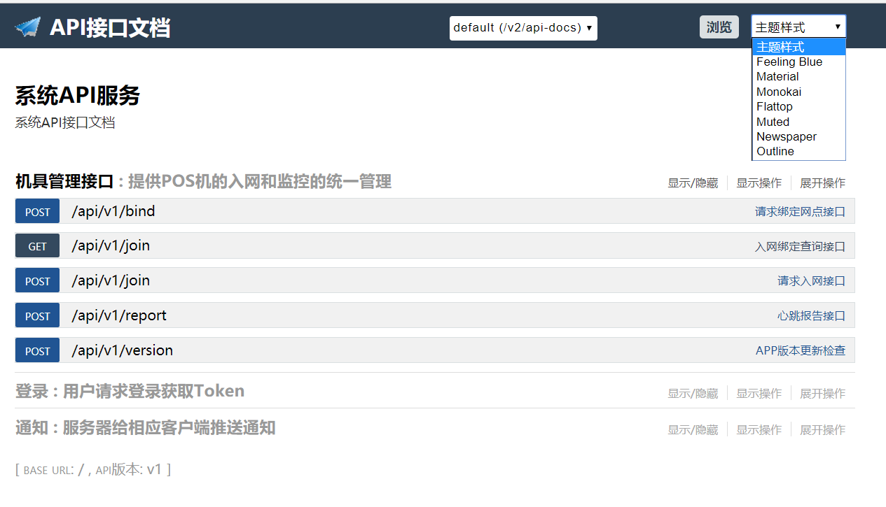

swagger-ui
===============================

自定义风格的RESTful-API文档

## 使用方法

这里以SpringBoot为例子。

在maven中添加如下依赖：

```
    <dependency>
        <groupId>io.springfox</groupId>
        <artifactId>springfox-swagger2</artifactId>
        <version>2.7.0</version>
    </dependency>
    <dependency>
        <groupId>com.xncoding</groupId>
        <artifactId>springfox-swagger-ui</artifactId>
        <version>2.7.0</version>
    </dependency>
```

然后添加一个Swagger2配置：

``` java
@Configuration
@EnableSwagger2
public class Swagger2Config {

    @Bean
    public Docket createRestApi() {
        return new Docket(DocumentationType.SWAGGER_2)
                .apiInfo(apiInfo())
                .select()
                // 指定controller存放的目录路径
                .apis(RequestHandlerSelectors.basePackage("com.enzhico.jwt.api"))
//                .paths(PathSelectors.ant("/api/v1/*"))
                .paths(PathSelectors.any())
                .build();
    }

    private ApiInfo apiInfo() {
        return new ApiInfoBuilder()
                // 文档标题
                .title("系统API服务")
                // 文档描述
                .description("系统API接口文档")
                // .termsOfServiceUrl("https://github.com/yidao620c")
                .version("v1")
                // .license("MIT 协议")
                // .licenseUrl("http://www.opensource.org/licenses/MIT")
                // .contact(new Contact("熊能","https://github.com/yidao620c","yidao620@gmail.com"))
                .build();
    }
}
```

在Controller中添加相应的Swagger2注解即可，更详细教程可以参考我的博客：
[SpringBoot系列 - 集成Swagger2](https://www.xncoding.com/2017/07/07/spring/sb-swagger2.html)

访问地址：<http://localhost:port/swagger-ui.html>

支持如下8种主题样式

* 默认
* Feeling Blue
* Material
* Monokai
* Flattop
* Muted
* Newspaper
* Outline

*主题样式风格如下*



